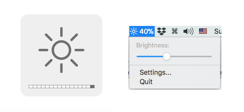

# NativeDisplayBrightness

*Control the brightness of external monitors with your Mac's brightness keys!*

This a utility application to control the brightness of external monitors directly from your keyboard.

Use the `F1` /  `F2` key to decrease / increase the brightness of the screen showing the active window. If you have an Apple or similar keyboard, you probably need to also press the `fn` key.

For a finer brightness level adjustment, you add the option key, i.e use `alt` + `F1` to decrease the brightness, or  `alt` + `F2` to increase it.

This app  shows the **native** system UI when changing brightness! 

## Multiple monitors support

If you have multiple external monitors connected to your Mac, the brightness adjustment is done on the monitor with the currently active window, and the brightness system UI is displayed on the adjusted monitor.

If you press the `shift` key in conjunction with the `F1` or  `F2` keys, then the brightness is ajusted on all connected screens simultaneously (including the builtin screen on a MacBook)  and the brightness system UI is displayed on every screen to indicate the current brightness of the screen.
## Monitors compatibility

Your monitor needs to support DDC/CI for this app to work. If you don't see the brightness system UI displayed on your monitor when pressing the F1 / F2 keys, this means that your monitor is not supported.

If your monitor supports reading the current brightness value from  DDC/CI, the app increments / decrements the brightness starting from the monitor current brightness value. This allows you to set the brightness using the monitor's OSD and to adjust it later with the app

## Implementation notes

For showing the native system UI for brightness adjustment, this app uses the macOS private framework `BezelServices`.

## Requirements

macOS version: 10.10 to 10.14

## License

This application uses code borrowed from [ddcctl](https://github.com/kfix/ddcctl) which uses code from [DDC-CI-Tools](https://github.com/jontaylor/DDC-CI-Tools-for-OS-X)

GNU GENERAL PUBLIC LICENSE
