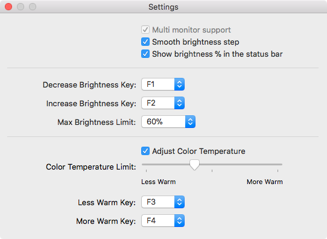

# Project is not actively developed.

This application was originally light and simple, for one monitor.

# As a whole new level, I highly recommend this incredibly cool project:
# https://github.com/MonitorControl/MonitorControl

# NativeDisplayBrightness

https://www.tonymacx86.com/threads/nativedisplaybrightness-with-gui-fork.256152/

*Control your desktop monitor brightness just like on a MacBook!*

This a utility application to control the brightness and color temperature of an external monitor directly from your keyboard.

Use the `F1` /  `F2` key to decrease / increase the brightness of the external monitor. If you have an Apple or similar keyboard, you probably need to also press the `fn` key.

Also you can set any key from `F1` to `F20` in the settings for changing of brightness or color temperature.

For a finer brightness level adjustment, you add the option key, i.e use `Alt` + `F1` to decrease the brightness, or  `Alt` + `F2` to increase it. Also you can enable smooth step in the settings.

This app  shows the **native** system UI when changing brightness! It uses the private `BezelServices` framework for this.

## Monitors compatibility

Your monitor needs to support DDC/CI for this app to work. If you don't see the brightness system UI displayed on your monitor when pressing the F1 / F2 keys, this means that your monitor is not supported.

If your monitor supports reading the current brightness value from  DDC/CI, the app increments / decrements the brightness starting from the monitor current brightness value. This allows you to set the brightness using the monitor's OSD and to adjust it later with the app

## Multiple monitors support

If you have multiple external monitors connected to your Mac, the brightness adjustment is done on the monitor with the currently active window, and the brightness system UI is displayed on the adjusted monitor.

## Requirements

macOS version: 10.12.4 or later

## License

This application uses code borrowed from [ddcctl](https://github.com/kfix/ddcctl) which uses code from [DDC-CI-Tools](https://github.com/jontaylor/DDC-CI-Tools-for-OS-X)

GNU GENERAL PUBLIC LICENSE
